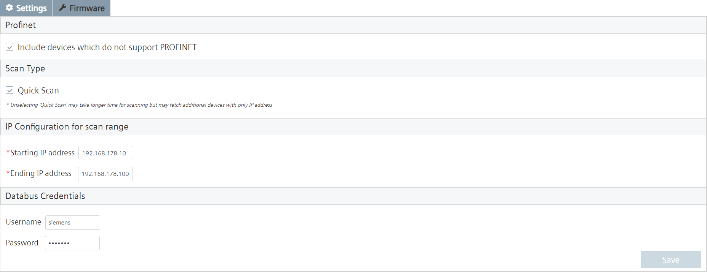
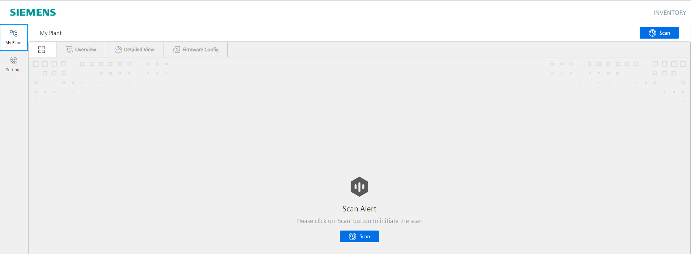
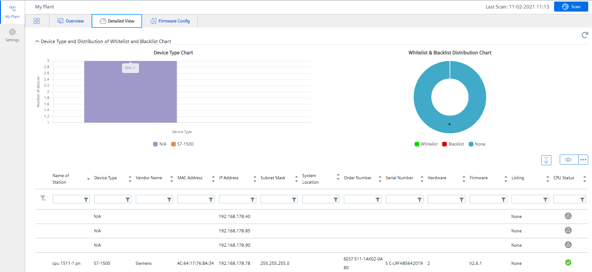

# Configuration

- [Configuration](#configuration)
  - [Configure PLC Connection](#configure-plc-connection)
    - [Configure Databus](#configure-databus)
    - [Configure S7 Connector](#configure-s7-connector)
  - [Configure Inventory](#configure-Inventory)
    - [Configure Inventory Configurator](#configure-Inventory-configurator)
    - [Configure Inventory Overview](#configure-Inventory-overview)

## Configure PLC Connection

To read data from the PLC and provide the data, we will use S7 Connector to establish connection with the PLC via OPC UA.

The S7 Connector sends the data to the Databus, where the Data Service app can collect what is needed.

In order to build this infrastructure, these apps must be configured properly:

- Databus
- S7 Connector

### Configure Databus

In your IEM open the Databus and launch the configurator.

Add a user with this topic:
`"ie/#"`

Deploy the configuration.

### Configure S7 Connector

In your IEM open the S7 Connector and launch the configurator.

Add a data source:

Add needed tags:

Edit the settings:

Hint: Username and password should be the same for all system apps, e.g. "edge" / "edge".

Deploy and start the project.

## Configure Inventory

In your IED Web UI open the app Inventory Configurator.

### Configure Inventory Configurator

When you start the Inventory Configurator, the section When you start the Inventory Configurator, the section 'Settings' is displayed on the start page. 

In this section, you can specify the IP address for the scan range and the IE Databus credentials and save them on the "Save" button.

In the Firmware section, you can configure the firmware for a device type. You can categorise the firmware as whitelist or blacklist. 

Based on these settings, the device data is displayed in the inventory application.

### Configure Inventory Overview

When you start the web application "Inventory", click on "Scan" to start the scan.

When you initiate the scan, the Inventory application scans the devices based on the configured IP address range in Inventory Configurator and displays the summary of all Siemens-supported Profinet and non-Profinet devices as well as TCP protocol-supported devices connected to the Industrial Edge Device (IED).

The "Detail View" area contains all further unit details, such as the name of the station, the unit type, the Mac address and so on. In addition, the device type and firmware versions are displayed here using doughnut diagrams.

